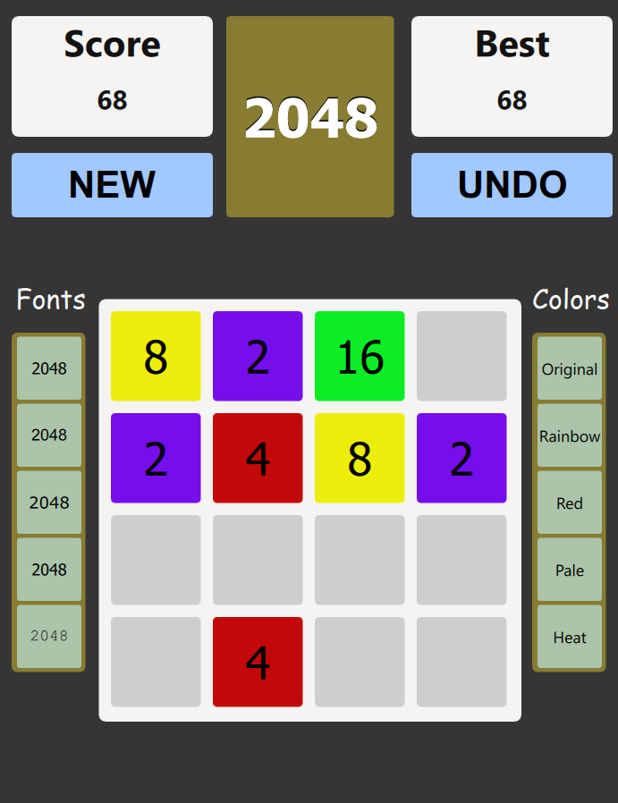

# 2048 Game

** It is recommended to run the application with the kit "MINGW".**
**If another kit is used, an error may appear. In that case, please press the 'ignore' button to continue running the application.**

## Description
This project is an implementation of the popular 2048 puzzle game. The objective is to combine tiles with the same value by moving them in four possible directions (up, down, left, right) until you reach the 2048 tile. With every move, a new tile is generated, adding complexity to the game.

### Game Controls

- **Movement:** Tiles move in the directions up, down, left, or right using the arrow keys.
- **Merging:** When two tiles with the same number collide, they merge into one tile with the sum of their values.
- **Game End:** The game ends when the grid is full and no more moves are possible, or when the player reaches the 2048 tile.

### Customization Options

In addition to the game controls, two buttons and two menus are available to personalize the experience:

- **UNDO:** Allows you to undo the last move, which can be useful to correct a mistake or try different strategies.
- **NEW:** Starts a new game, resetting the grid.
- **FONTS:** Allows you to choose from a selection of fonts for displaying the tiles.
- **COLORS:** Allows you to change the color of the tiles and the background according to the player's preferences.

### Game Interface

## How to Play
1. Use the arrow keys (or your input method) to move the tiles.
2. Combine tiles of the same value to increase their total.
3. Reach the 2048 tile to win, but you can keep playing to achieve higher scores!
